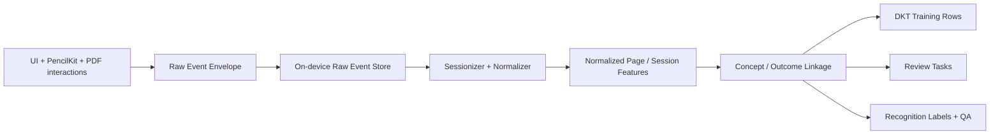

# Pharnote Production Event Schema

## 1. Purpose
This document defines the production event model for `pharnote`.

It exists for one reason: the current analysis surface is useful, but it is not enough for reliable internal intelligence, DKT, review generation, or correction learning unless raw event collection is explicit and versioned.

This schema is the authoritative source for:
1. what the app logs,
2. when it logs it,
3. how high-frequency events are batched,
4. how raw events become normalized features,
5. which events are eligible to become training rows.

## 2. Design Rules
1. Raw events are append-only.
2. Raw events are never retroactively mutated.
3. High-frequency handwriting activity is recorded as batches, not per-point or per-stroke-frame.
4. Training rows are derived artifacts, not source-of-truth records.
5. Every event must be attributable to a learner, device, app version, and local ordering position.
6. Event collection must not block drawing or scrolling.
7. Missing optional fields are allowed, but required IDs are not.
8. Any event used for DKT must be joinable to `concept_id` and `outcome` later.

## 3. Event Pipeline



## 4. Envelope Schema
All events use the same outer envelope.

```json
{
  "event_id": "uuid",
  "schema_version": 1,
  "event_type": "page_enter",
  "event_time": "2026-03-08T12:00:00+09:00",
  "sequence_no": 1842,
  "learner_id": "uuid",
  "device_id": "uuid",
  "installation_id": "uuid",
  "session_id": "uuid|null",
  "document_id": "uuid|null",
  "page_id": "uuid|null",
  "document_type": "blankNote|pdf|null",
  "app_version": "1.0.0",
  "build_number": "100",
  "platform": "iPadOS",
  "payload": {}
}
```

### Required fields
| Field | Required | Notes |
| --- | --- | --- |
| `event_id` | yes | UUIDv4 |
| `schema_version` | yes | event schema version |
| `event_type` | yes | stable taxonomy string |
| `event_time` | yes | ISO-8601 with timezone |
| `sequence_no` | yes | monotonic local counter per installation |
| `learner_id` | yes | anonymous stable user ID |
| `device_id` | yes | anonymous stable device ID |
| `installation_id` | yes | local install identity |
| `app_version` | yes | semantic version |
| `build_number` | yes | build metadata |
| `platform` | yes | currently `iPadOS` |
| `payload` | yes | event-specific body |

### Optional fields
| Field | Optional | Notes |
| --- | --- | --- |
| `session_id` | yes | absent until sessionizer assigns one |
| `document_id` | yes | not every event belongs to a document |
| `page_id` | yes | not every event belongs to a page |
| `document_type` | yes | `blankNote` or `pdf` when known |

## 5. Event Taxonomy

### 5.1 Navigation Events
These define attention boundaries and are mandatory for dwell calculations.

| Event type | Trigger | Required payload |
| --- | --- | --- |
| `app_foregrounded` | app becomes active | `{ "reason": "launch|resume" }` |
| `app_backgrounded` | app moves to background | `{ "reason": "home|interrupt|system" }` |
| `document_opened` | editor opened | `{ "entry_source": "library|recent|analysis|review" }` |
| `document_closed` | editor dismissed | `{ "close_reason": "back|switch|system" }` |
| `page_enter` | page becomes current | `{ "page_index": 12, "entry_source": "thumbnail|search|jump|swipe|restore" }` |
| `page_exit` | current page loses focus | `{ "page_index": 12, "exit_reason": "page_change|close|background" }` |
| `thumbnail_scrolled` | user scrolls thumbnail strip | `{ "visible_range": [10, 24] }` |
| `page_jump_submitted` | user jumps to page | `{ "from_page_index": 3, "to_page_index": 41 }` |

### 5.2 Annotation Tool Events
These capture intent and tool distribution.

| Event type | Trigger | Required payload |
| --- | --- | --- |
| `annotation_tool_selected` | tool changed | `{ "tool": "pen|highlighter|eraser|lasso|shape|text", "source": "toolbar|pencil_shortcut" }` |
| `annotation_color_selected` | color changed | `{ "tool": "pen", "color_id": "phar_blue", "rgba_hex": "#2A63FF" }` |
| `annotation_width_selected` | stroke width changed | `{ "tool": "pen", "width": 4.0 }` |
| `input_mode_changed` | pencil-only/touch mode changed | `{ "allows_finger_drawing": false }` |
| `tool_palette_toggled` | floating dock expanded/collapsed | `{ "visible": true }` |

### 5.3 Handwriting Batch Events
These are the core note-taking events. They must be batched.

| Event type | Trigger | Required payload |
| --- | --- | --- |
| `stroke_batch_committed` | debounce after drawing edit | `{ "batch_id": "uuid", "stroke_count_delta": 4, "ink_length_estimate": 142.2, "tool": "pen", "page_index": 5 }` |
| `highlight_batch_committed` | debounce after highlight edit | `{ "batch_id": "uuid", "stroke_count_delta": 2, "coverage_delta": 0.08, "page_index": 5 }` |
| `eraser_batch_committed` | debounce after erase edit | `{ "batch_id": "uuid", "erase_delta": 0.12, "page_index": 5 }` |
| `canvas_saved` | drawing persisted | `{ "save_reason": "debounce|background|page_change|manual" }` |

#### Batching rules
1. Collect drawing deltas in memory while user is actively editing.
2. Flush a batch at one of:
   - 2-5 seconds of inactivity,
   - page switch,
   - app background,
   - manual save,
   - explicit analyze request.
3. Never emit per-point events.
4. Never emit one event per PKStroke unless a debug mode is enabled.

### 5.4 Editing / Selection Events
These matter for struggle and revision analysis.

| Event type | Trigger | Required payload |
| --- | --- | --- |
| `undo_invoked` | undo action | `{ "source": "toolbar|keyboard|gesture" }` |
| `redo_invoked` | redo action | `{ "source": "toolbar|keyboard|gesture" }` |
| `lasso_started` | lasso begins | `{ "page_index": 5 }` |
| `lasso_selection_committed` | lasso selection finalized | `{ "selected_stroke_count": 12 }` |
| `selection_moved` | selected strokes moved | `{ "selected_stroke_count": 12, "distance": 84.3 }` |
| `selection_copied` | copy selected strokes/text | `{ "selection_kind": "ink|mixed" }` |
| `selection_pasted` | paste action | `{ "selection_kind": "ink|mixed", "destination_page_index": 6 }` |
| `selection_deleted` | delete selected content | `{ "selection_kind": "ink|mixed" }` |

### 5.5 PDF Reading Events
These capture behavior that is not handwriting but still matters.

| Event type | Trigger | Required payload |
| --- | --- | --- |
| `pdf_search_started` | search query submitted | `{ "query_length": 6 }` |
| `pdf_search_result_opened` | result tapped | `{ "query": "적분", "result_rank": 2, "target_page_index": 38 }` |
| `pdf_zoom_changed` | zoom stabilized after interaction | `{ "scale": 1.75 }` |
| `pdf_bookmark_toggled` | bookmark changed | `{ "bookmarked": true, "page_index": 38 }` |
| `pdf_text_selection_created` | PDF text selected | `{ "character_count": 81 }` |

### 5.6 Study Semantics Events
These convert UI actions into analyzable intent.

| Event type | Trigger | Required payload |
| --- | --- | --- |
| `study_intent_selected` | user chooses intent in analyze UI or doc setup | `{ "study_intent": "lecture|problem_solving|summary|review|exam_prep|unknown" }` |
| `subject_confirmed` | user confirms subject | `{ "subject_id": "math", "source": "manual|suggestion" }` |
| `unit_corrected` | user corrects unit inference | `{ "before_unit_id": "math.integral", "after_unit_id": "math.substitution_integral" }` |
| `concept_confirmed` | user confirms concept chip | `{ "concept_id": "math.substitution_integral" }` |

### 5.7 Analysis Events
These track the intelligence loop itself.

| Event type | Trigger | Required payload |
| --- | --- | --- |
| `analysis_requested` | Analyze tapped | `{ "bundle_id": "uuid", "scope": "page", "study_intent": "summary" }` |
| `analysis_bundle_persisted` | bundle saved locally | `{ "bundle_id": "uuid", "bundle_version": 1 }` |
| `analysis_completed` | result stored | `{ "bundle_id": "uuid", "analysis_id": "uuid", "result_version": 1 }` |
| `analysis_failed` | failure during local or remote analysis | `{ "bundle_id": "uuid", "failure_kind": "validation|network|engine|storage" }` |
| `analysis_result_opened` | result viewed by user | `{ "analysis_id": "uuid" }` |
| `analysis_action_invoked` | recommended action tapped | `{ "analysis_id": "uuid", "action_kind": "retry|review_later|summarize" }` |

### 5.8 Problem Attempt Events
These are mandatory for concept-level DKT.

| Event type | Trigger | Required payload |
| --- | --- | --- |
| `problem_attempt_started` | user starts solving a bounded problem unit | `{ "problem_attempt_id": "uuid", "problem_ref": "page-region-03", "page_index": 8 }` |
| `problem_attempt_checkpointed` | intermediate save | `{ "problem_attempt_id": "uuid", "revision_count": 3, "elapsed_ms": 82000 }` |
| `problem_attempt_submitted` | user marks problem as done | `{ "problem_attempt_id": "uuid", "correctness": "correct|incorrect|partial|unknown", "partial_score": 0.5, "self_confidence": 0.42 }` |
| `problem_attempt_reopened` | retry starts later | `{ "problem_attempt_id": "uuid", "retry_index": 2 }` |

### 5.9 Recall / Memorization Events
These are mandatory for spaced review.

| Event type | Trigger | Required payload |
| --- | --- | --- |
| `recall_attempt_started` | recall trial begins | `{ "recall_attempt_id": "uuid", "cue_type": "flashcard|hide_and_recall|self_quiz" }` |
| `recall_self_rated` | user gives recall quality | `{ "recall_attempt_id": "uuid", "result": "success|weak_success|failure|skip", "self_confidence": 0.63 }` |
| `recall_attempt_finished` | recall finalized | `{ "recall_attempt_id": "uuid", "response_latency_ms": 5200, "scheduled_interval_hours": 24 }` |

### 5.10 Review Loop Events
These tie intelligence to behavior.

| Event type | Trigger | Required payload |
| --- | --- | --- |
| `review_task_created` | task generated | `{ "review_task_id": "uuid", "reason": "low_mastery|high_revision|failed_recall" }` |
| `review_task_opened` | user opens task | `{ "review_task_id": "uuid" }` |
| `review_task_completed` | user completes task | `{ "review_task_id": "uuid", "completion_mode": "restudy|retry|recall" }` |
| `review_task_dismissed` | task dismissed | `{ "review_task_id": "uuid", "dismiss_reason": "not_relevant|later|done_elsewhere" }` |

### 5.11 Correction / Feedback Events
These are critical for calibration and future relabeling.

| Event type | Trigger | Required payload |
| --- | --- | --- |
| `prediction_corrected` | user overrides prediction | `{ "target_type": "subject|unit|concept|study_mode|page_role", "before": "math", "after": "physics" }` |
| `feedback_submitted` | explicit thumbs up/down on insight | `{ "analysis_id": "uuid", "feedback": "helpful|not_helpful" }` |

## 6. Event-to-Feature Mapping

### Page-level normalized features
Derived from one or more raw events:
1. `dwell_ms` <- `page_enter` + `page_exit`
2. `foreground_edit_ms` <- edit-active windows across drawing and selection batches
3. `stroke_count` <- `stroke_batch_committed`
4. `ink_length_estimate` <- `stroke_batch_committed`
5. `erase_ratio` <- `eraser_batch_committed` / total draw activity
6. `highlight_coverage` <- `highlight_batch_committed`
7. `undo_count` <- `undo_invoked`
8. `redo_count` <- `redo_invoked`
9. `lasso_actions` <- `lasso_selection_committed`
10. `copy_actions` <- `selection_copied`
11. `paste_actions` <- `selection_pasted`
12. `revisit_count` <- number of non-initial `page_enter` for same page in session
13. `zoom_event_count` <- `pdf_zoom_changed`
14. `bookmark_state` <- latest `pdf_bookmark_toggled`
15. `dominant_tool` <- distribution across tool events and draw batches

### Session-level normalized features
1. `session_duration_ms`
2. `page_count_visited`
3. `dominant_study_intent`
4. `dominant_subject_id`
5. `dominant_unit_id`
6. `navigation_entropy`
7. `revision_intensity`
8. `problem_attempt_count`
9. `recall_attempt_count`
10. `analysis_request_count`

## 7. Sessionization Rules
1. Start a new session when the app becomes active and the user opens a document.
2. Split session after 20 minutes of inactivity.
3. Split session on explicit document-type change if context is materially different.
4. Keep same session across adjacent page moves within one working flow.
5. If app backgrounds for less than 5 minutes, attempt resume into same session.
6. If background exceeds 5 minutes, create a new session unless the user explicitly resumes the same review task.

## 8. Performance Constraints
1. Event writes must be non-blocking and off the drawing path.
2. Raw events should be persisted on a serial background writer.
3. High-frequency batches should be compressed only after commit, not before UI returns.
4. PDF zoom events should be throttled; only stabilized values should be written.
5. Selection move events should not emit every frame; summarize on commit.

## 9. Data Quality Rules
1. Reject events missing `event_id`, `event_time`, `event_type`, or `sequence_no`.
2. Reject training rows with null `concept_id`.
3. Reject DKT rows with missing `outcome`.
4. Flag sessions with impossible timestamps or negative elapsed time.
5. Flag pages with edit activity but no `page_enter` boundary.
6. Flag duplicate `sequence_no` per installation.

## 10. Mapping to Current Code
Current models already support a partial subset of this schema:
- `AnalysisBehaviorContext` in [AnalysisModels.swift](/Users/osteoclasts_/Desktop/coding/pharnote/pharnote/Models/AnalysisModels.swift)
- page dwell / revisit / tool usage logic in [BlankNoteEditorViewModel.swift](/Users/osteoclasts_/Desktop/coding/pharnote/pharnote/ViewModels/BlankNoteEditorViewModel.swift)
- page dwell / revisit / tool usage logic in [PDFEditorViewModel.swift](/Users/osteoclasts_/Desktop/coding/pharnote/pharnote/ViewModels/PDFEditorViewModel.swift)

What must be added next in code:
1. persistent raw event store service,
2. event emitter layer shared by blank note and PDF editors,
3. problem attempt model and UI boundaries,
4. recall attempt model and UI boundaries,
5. correction event pipeline,
6. sessionizer and normalizer.

## 11. Non-Goals
This schema does not define:
1. model architecture,
2. server API contracts,
3. public source acquisition,
4. annotation review tooling.

Those belong in separate documents.
