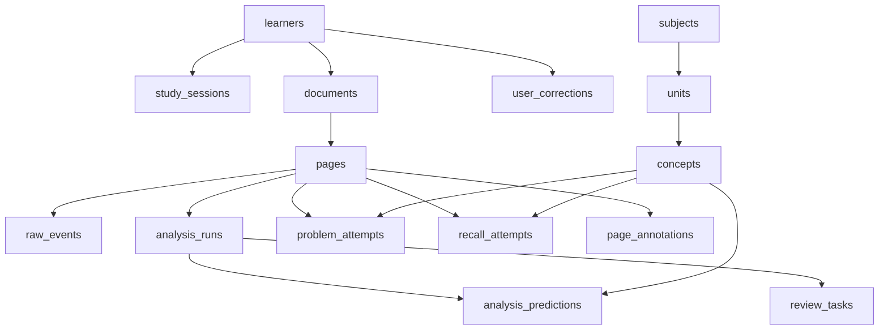

# Pharnote Production DB Schema

## 1. Purpose
This document defines the production database shape for `pharnote` internal intelligence.

The design is intentionally split:
1. on-device store for low-latency capture and offline resilience,
2. server-side analytical store for normalization, model training, review generation, and lineage.

Do not collapse these two concerns into one schema. SQLite and Postgres should share concepts, not identical operational assumptions.

## 2. Storage Layers

### On-device SQLite
Use for:
1. raw event persistence,
2. session state,
3. queued analysis bundles,
4. local predictions and review tasks,
5. correction queue,
6. retryable sync state.

### Server-side Postgres
Use for:
1. canonical ontology,
2. aggregated learner history,
3. normalized feature tables,
4. DKT training rows,
5. annotation and QA,
6. model and dataset lineage,
7. reporting and evaluation.

## 3. Core Entity Model



## 4. Canonical IDs
All operational IDs must be stable and explicit.

| Entity | ID type | Notes |
| --- | --- | --- |
| learner | UUID | anonymous stable identifier |
| installation | UUID | per app install |
| device | UUID | per device |
| document | UUID | local + sync-safe |
| page | UUID | stable across edits |
| session | UUID | assigned by sessionizer |
| problem_attempt | UUID | user-bounded attempt |
| recall_attempt | UUID | recall trial |
| analysis | UUID | one execution |
| review_task | UUID | one generated review item |
| correction | UUID | one explicit correction |
| dataset_version | string / UUID | immutable version ref |
| model_version | string / UUID | immutable version ref |

## 5. On-Device SQLite Schema

### 5.1 Identity and State
```sql
CREATE TABLE IF NOT EXISTS app_installation (
  installation_id TEXT PRIMARY KEY,
  learner_id TEXT NOT NULL,
  device_id TEXT NOT NULL,
  created_at TEXT NOT NULL,
  updated_at TEXT NOT NULL
);

CREATE TABLE IF NOT EXISTS local_sessions (
  session_id TEXT PRIMARY KEY,
  learner_id TEXT NOT NULL,
  started_at TEXT NOT NULL,
  ended_at TEXT,
  dominant_document_id TEXT,
  dominant_subject_id TEXT,
  dominant_unit_id TEXT,
  dominant_study_intent TEXT,
  sync_state TEXT NOT NULL DEFAULT 'local_only'
);
```

### 5.2 Raw Event Store
```sql
CREATE TABLE IF NOT EXISTS raw_events (
  event_id TEXT PRIMARY KEY,
  schema_version INTEGER NOT NULL,
  event_type TEXT NOT NULL,
  event_time TEXT NOT NULL,
  sequence_no INTEGER NOT NULL,
  learner_id TEXT NOT NULL,
  installation_id TEXT NOT NULL,
  device_id TEXT NOT NULL,
  session_id TEXT,
  document_id TEXT,
  page_id TEXT,
  document_type TEXT,
  app_version TEXT NOT NULL,
  build_number TEXT NOT NULL,
  platform TEXT NOT NULL,
  payload_json TEXT NOT NULL,
  created_at TEXT NOT NULL,
  sync_state TEXT NOT NULL DEFAULT 'pending'
);

CREATE UNIQUE INDEX IF NOT EXISTS idx_raw_events_install_sequence
ON raw_events(installation_id, sequence_no);

CREATE INDEX IF NOT EXISTS idx_raw_events_session_time
ON raw_events(session_id, event_time);

CREATE INDEX IF NOT EXISTS idx_raw_events_page_time
ON raw_events(page_id, event_time);
```

### 5.3 Local Analysis State
```sql
CREATE TABLE IF NOT EXISTS local_analysis_runs (
  analysis_id TEXT PRIMARY KEY,
  bundle_id TEXT NOT NULL,
  document_id TEXT NOT NULL,
  page_id TEXT NOT NULL,
  session_id TEXT,
  bundle_version INTEGER NOT NULL,
  result_version INTEGER,
  status TEXT NOT NULL,
  requested_at TEXT NOT NULL,
  completed_at TEXT,
  bundle_path TEXT NOT NULL,
  result_path TEXT,
  last_error_message TEXT
);

CREATE TABLE IF NOT EXISTS local_analysis_actions (
  id TEXT PRIMARY KEY,
  analysis_id TEXT NOT NULL,
  action_kind TEXT NOT NULL,
  invoked_at TEXT NOT NULL,
  payload_json TEXT NOT NULL
);
```

### 5.4 Local Review Queue
```sql
CREATE TABLE IF NOT EXISTS local_review_tasks (
  review_task_id TEXT PRIMARY KEY,
  learner_id TEXT NOT NULL,
  document_id TEXT,
  page_id TEXT,
  concept_id TEXT,
  source_analysis_id TEXT,
  task_type TEXT NOT NULL,
  due_at TEXT NOT NULL,
  priority INTEGER NOT NULL DEFAULT 0,
  status TEXT NOT NULL DEFAULT 'pending',
  created_at TEXT NOT NULL,
  updated_at TEXT NOT NULL,
  sync_state TEXT NOT NULL DEFAULT 'pending'
);
```

### 5.5 Local Corrections Queue
```sql
CREATE TABLE IF NOT EXISTS local_user_corrections (
  correction_id TEXT PRIMARY KEY,
  learner_id TEXT NOT NULL,
  target_type TEXT NOT NULL,
  target_ref_id TEXT NOT NULL,
  before_value TEXT,
  after_value TEXT NOT NULL,
  source_model_version TEXT,
  created_at TEXT NOT NULL,
  sync_state TEXT NOT NULL DEFAULT 'pending'
);
```

## 6. Server-Side Postgres Schema

### 6.1 Domain Tables
```sql
CREATE TABLE subjects (
  subject_id TEXT PRIMARY KEY,
  name TEXT NOT NULL,
  locale TEXT NOT NULL DEFAULT 'ko-KR',
  created_at TIMESTAMPTZ NOT NULL DEFAULT NOW()
);

CREATE TABLE units (
  unit_id TEXT PRIMARY KEY,
  subject_id TEXT NOT NULL REFERENCES subjects(subject_id),
  parent_unit_id TEXT REFERENCES units(unit_id),
  name TEXT NOT NULL,
  order_index INTEGER,
  created_at TIMESTAMPTZ NOT NULL DEFAULT NOW()
);

CREATE TABLE concepts (
  concept_id TEXT PRIMARY KEY,
  unit_id TEXT NOT NULL REFERENCES units(unit_id),
  name TEXT NOT NULL,
  description TEXT,
  created_at TIMESTAMPTZ NOT NULL DEFAULT NOW()
);

CREATE TABLE concept_aliases (
  alias_id BIGSERIAL PRIMARY KEY,
  concept_id TEXT NOT NULL REFERENCES concepts(concept_id),
  alias TEXT NOT NULL,
  source_type TEXT NOT NULL,
  confidence NUMERIC(4,3),
  created_at TIMESTAMPTZ NOT NULL DEFAULT NOW()
);

CREATE TABLE misconception_codes (
  misconception_code TEXT PRIMARY KEY,
  subject_id TEXT REFERENCES subjects(subject_id),
  unit_id TEXT REFERENCES units(unit_id),
  label TEXT NOT NULL,
  description TEXT,
  created_at TIMESTAMPTZ NOT NULL DEFAULT NOW()
);
```

### 6.2 Learner / Document / Page Tables
```sql
CREATE TABLE learners (
  learner_id UUID PRIMARY KEY,
  locale TEXT NOT NULL DEFAULT 'ko-KR',
  grade_band TEXT,
  created_at TIMESTAMPTZ NOT NULL DEFAULT NOW()
);

CREATE TABLE documents (
  document_id UUID PRIMARY KEY,
  learner_id UUID NOT NULL REFERENCES learners(learner_id),
  document_type TEXT NOT NULL,
  title TEXT NOT NULL,
  declared_subject_id TEXT REFERENCES subjects(subject_id),
  source_fingerprint TEXT,
  created_at TIMESTAMPTZ NOT NULL,
  updated_at TIMESTAMPTZ NOT NULL
);

CREATE TABLE pages (
  page_id UUID PRIMARY KEY,
  document_id UUID NOT NULL REFERENCES documents(document_id),
  page_index INTEGER NOT NULL,
  template TEXT,
  source_page_ref TEXT,
  created_at TIMESTAMPTZ NOT NULL,
  updated_at TIMESTAMPTZ NOT NULL,
  UNIQUE(document_id, page_index)
);
```

### 6.3 Session and Raw Event Tables
```sql
CREATE TABLE study_sessions (
  session_id UUID PRIMARY KEY,
  learner_id UUID NOT NULL REFERENCES learners(learner_id),
  started_at TIMESTAMPTZ NOT NULL,
  ended_at TIMESTAMPTZ,
  dominant_document_id UUID REFERENCES documents(document_id),
  dominant_subject_id TEXT REFERENCES subjects(subject_id),
  dominant_unit_id TEXT REFERENCES units(unit_id),
  dominant_study_intent TEXT,
  source_app_version TEXT,
  created_at TIMESTAMPTZ NOT NULL DEFAULT NOW()
);

CREATE TABLE raw_events (
  event_id UUID PRIMARY KEY,
  schema_version INTEGER NOT NULL,
  event_type TEXT NOT NULL,
  event_time TIMESTAMPTZ NOT NULL,
  sequence_no BIGINT NOT NULL,
  learner_id UUID NOT NULL REFERENCES learners(learner_id),
  installation_id UUID NOT NULL,
  device_id UUID NOT NULL,
  session_id UUID REFERENCES study_sessions(session_id),
  document_id UUID REFERENCES documents(document_id),
  page_id UUID REFERENCES pages(page_id),
  document_type TEXT,
  app_version TEXT NOT NULL,
  build_number TEXT NOT NULL,
  platform TEXT NOT NULL,
  payload JSONB NOT NULL,
  created_at TIMESTAMPTZ NOT NULL DEFAULT NOW(),
  UNIQUE(installation_id, sequence_no)
);

CREATE INDEX idx_raw_events_session_time ON raw_events(session_id, event_time);
CREATE INDEX idx_raw_events_page_time ON raw_events(page_id, event_time);
CREATE INDEX idx_raw_events_type_time ON raw_events(event_type, event_time);
```

### 6.4 Normalized Feature Tables
These are derived tables, not user-entered data.

```sql
CREATE TABLE normalized_page_features (
  feature_row_id BIGSERIAL PRIMARY KEY,
  learner_id UUID NOT NULL REFERENCES learners(learner_id),
  session_id UUID REFERENCES study_sessions(session_id),
  document_id UUID NOT NULL REFERENCES documents(document_id),
  page_id UUID NOT NULL REFERENCES pages(page_id),
  observed_at TIMESTAMPTZ NOT NULL,
  dwell_ms INTEGER,
  foreground_edit_ms INTEGER,
  stroke_count INTEGER,
  ink_length_estimate NUMERIC(12,3),
  erase_ratio NUMERIC(8,5),
  highlight_coverage NUMERIC(8,5),
  undo_count INTEGER,
  redo_count INTEGER,
  lasso_actions INTEGER,
  copy_actions INTEGER,
  paste_actions INTEGER,
  revisit_count INTEGER,
  zoom_event_count INTEGER,
  dominant_tool TEXT,
  study_intent TEXT,
  inferred_subject_id TEXT REFERENCES subjects(subject_id),
  inferred_unit_id TEXT REFERENCES units(unit_id),
  inferred_page_role TEXT,
  feature_version TEXT NOT NULL,
  created_at TIMESTAMPTZ NOT NULL DEFAULT NOW()
);

CREATE TABLE normalized_session_features (
  feature_row_id BIGSERIAL PRIMARY KEY,
  learner_id UUID NOT NULL REFERENCES learners(learner_id),
  session_id UUID NOT NULL REFERENCES study_sessions(session_id),
  observed_at TIMESTAMPTZ NOT NULL,
  session_duration_ms INTEGER,
  page_count_visited INTEGER,
  problem_attempt_count INTEGER,
  recall_attempt_count INTEGER,
  analysis_request_count INTEGER,
  dominant_subject_id TEXT REFERENCES subjects(subject_id),
  dominant_unit_id TEXT REFERENCES units(unit_id),
  dominant_study_intent TEXT,
  revision_intensity NUMERIC(8,5),
  navigation_entropy NUMERIC(8,5),
  feature_version TEXT NOT NULL,
  created_at TIMESTAMPTZ NOT NULL DEFAULT NOW()
);
```

### 6.5 Problem Attempt Tables
```sql
CREATE TABLE problem_attempts (
  problem_attempt_id UUID PRIMARY KEY,
  learner_id UUID NOT NULL REFERENCES learners(learner_id),
  session_id UUID REFERENCES study_sessions(session_id),
  document_id UUID REFERENCES documents(document_id),
  page_id UUID REFERENCES pages(page_id),
  problem_ref TEXT,
  started_at TIMESTAMPTZ NOT NULL,
  ended_at TIMESTAMPTZ,
  correctness TEXT,
  partial_score NUMERIC(5,2),
  self_confidence NUMERIC(4,3),
  retry_index INTEGER NOT NULL DEFAULT 1,
  created_at TIMESTAMPTZ NOT NULL DEFAULT NOW()
);

CREATE TABLE problem_attempt_concepts (
  problem_attempt_id UUID NOT NULL REFERENCES problem_attempts(problem_attempt_id),
  concept_id TEXT NOT NULL REFERENCES concepts(concept_id),
  weight NUMERIC(4,3),
  PRIMARY KEY(problem_attempt_id, concept_id)
);

CREATE TABLE problem_attempt_labels (
  label_id BIGSERIAL PRIMARY KEY,
  problem_attempt_id UUID NOT NULL REFERENCES problem_attempts(problem_attempt_id),
  difficulty_label TEXT,
  solution_completeness TEXT,
  reasoning_visibility TEXT,
  revision_intensity_label TEXT,
  misconception_code TEXT REFERENCES misconception_codes(misconception_code),
  annotator_id TEXT,
  annotation_version TEXT NOT NULL,
  created_at TIMESTAMPTZ NOT NULL DEFAULT NOW()
);
```

### 6.6 Recall Attempt Tables
```sql
CREATE TABLE recall_attempts (
  recall_attempt_id UUID PRIMARY KEY,
  learner_id UUID NOT NULL REFERENCES learners(learner_id),
  session_id UUID REFERENCES study_sessions(session_id),
  document_id UUID REFERENCES documents(document_id),
  page_id UUID REFERENCES pages(page_id),
  cue_type TEXT NOT NULL,
  started_at TIMESTAMPTZ NOT NULL,
  ended_at TIMESTAMPTZ,
  recall_result TEXT,
  response_latency_ms INTEGER,
  self_confidence NUMERIC(4,3),
  scheduled_interval_hours INTEGER,
  created_at TIMESTAMPTZ NOT NULL DEFAULT NOW()
);

CREATE TABLE recall_attempt_concepts (
  recall_attempt_id UUID NOT NULL REFERENCES recall_attempts(recall_attempt_id),
  concept_id TEXT NOT NULL REFERENCES concepts(concept_id),
  weight NUMERIC(4,3),
  PRIMARY KEY(recall_attempt_id, concept_id)
);
```

### 6.7 Analysis and Prediction Tables
```sql
CREATE TABLE analysis_runs (
  analysis_id UUID PRIMARY KEY,
  bundle_id UUID NOT NULL,
  learner_id UUID NOT NULL REFERENCES learners(learner_id),
  document_id UUID REFERENCES documents(document_id),
  page_id UUID REFERENCES pages(page_id),
  session_id UUID REFERENCES study_sessions(session_id),
  bundle_version INTEGER NOT NULL,
  pipeline_version TEXT NOT NULL,
  status TEXT NOT NULL,
  requested_at TIMESTAMPTZ NOT NULL,
  completed_at TIMESTAMPTZ,
  created_at TIMESTAMPTZ NOT NULL DEFAULT NOW()
);

CREATE TABLE analysis_predictions (
  analysis_id UUID PRIMARY KEY REFERENCES analysis_runs(analysis_id),
  predicted_subject_id TEXT REFERENCES subjects(subject_id),
  predicted_unit_id TEXT REFERENCES units(unit_id),
  predicted_study_mode TEXT,
  predicted_page_role TEXT,
  mastery_score NUMERIC(4,3),
  confidence_score NUMERIC(4,3),
  struggle_score NUMERIC(4,3),
  difficulty_estimate NUMERIC(4,3),
  review_due_at TIMESTAMPTZ,
  result_payload JSONB NOT NULL,
  created_at TIMESTAMPTZ NOT NULL DEFAULT NOW()
);

CREATE TABLE analysis_prediction_concepts (
  analysis_id UUID NOT NULL REFERENCES analysis_runs(analysis_id),
  concept_id TEXT NOT NULL REFERENCES concepts(concept_id),
  mastery_score NUMERIC(4,3),
  confidence_score NUMERIC(4,3),
  evidence_strength NUMERIC(4,3),
  rank INTEGER,
  PRIMARY KEY(analysis_id, concept_id)
);
```

### 6.8 Review Task Tables
```sql
CREATE TABLE review_tasks (
  review_task_id UUID PRIMARY KEY,
  learner_id UUID NOT NULL REFERENCES learners(learner_id),
  document_id UUID REFERENCES documents(document_id),
  page_id UUID REFERENCES pages(page_id),
  concept_id TEXT REFERENCES concepts(concept_id),
  source_analysis_id UUID REFERENCES analysis_runs(analysis_id),
  task_type TEXT NOT NULL,
  reason_code TEXT,
  due_at TIMESTAMPTZ NOT NULL,
  priority INTEGER NOT NULL DEFAULT 0,
  status TEXT NOT NULL DEFAULT 'pending',
  created_at TIMESTAMPTZ NOT NULL DEFAULT NOW(),
  completed_at TIMESTAMPTZ
);
```

### 6.9 Annotation and QA Tables
```sql
CREATE TABLE page_annotations (
  annotation_id BIGSERIAL PRIMARY KEY,
  page_id UUID NOT NULL REFERENCES pages(page_id),
  annotator_id TEXT NOT NULL,
  subject_id TEXT REFERENCES subjects(subject_id),
  unit_id TEXT REFERENCES units(unit_id),
  study_mode TEXT,
  page_role TEXT,
  quality_score INTEGER,
  annotation_version TEXT NOT NULL,
  created_at TIMESTAMPTZ NOT NULL DEFAULT NOW()
);

CREATE TABLE page_annotation_concepts (
  annotation_id BIGINT NOT NULL REFERENCES page_annotations(annotation_id),
  concept_id TEXT NOT NULL REFERENCES concepts(concept_id),
  rank INTEGER,
  PRIMARY KEY(annotation_id, concept_id)
);

CREATE TABLE annotation_reviews (
  review_id BIGSERIAL PRIMARY KEY,
  target_type TEXT NOT NULL,
  target_ref_id TEXT NOT NULL,
  reviewer_id TEXT NOT NULL,
  decision TEXT NOT NULL,
  note TEXT,
  created_at TIMESTAMPTZ NOT NULL DEFAULT NOW()
);
```

### 6.10 User Correction Tables
```sql
CREATE TABLE user_corrections (
  correction_id UUID PRIMARY KEY,
  learner_id UUID NOT NULL REFERENCES learners(learner_id),
  target_type TEXT NOT NULL,
  target_ref_id TEXT NOT NULL,
  before_value TEXT,
  after_value TEXT NOT NULL,
  source_model_version TEXT,
  created_at TIMESTAMPTZ NOT NULL DEFAULT NOW()
);
```

### 6.11 Lineage Tables
```sql
CREATE TABLE dataset_versions (
  dataset_version_id TEXT PRIMARY KEY,
  dataset_name TEXT NOT NULL,
  description TEXT,
  created_at TIMESTAMPTZ NOT NULL DEFAULT NOW()
);

CREATE TABLE annotation_versions (
  annotation_version_id TEXT PRIMARY KEY,
  guideline_version TEXT NOT NULL,
  created_at TIMESTAMPTZ NOT NULL DEFAULT NOW()
);

CREATE TABLE model_versions (
  model_version_id TEXT PRIMARY KEY,
  model_name TEXT NOT NULL,
  training_dataset_version_id TEXT REFERENCES dataset_versions(dataset_version_id),
  description TEXT,
  created_at TIMESTAMPTZ NOT NULL DEFAULT NOW()
);
```

### 6.12 DKT Training Rows
This table is generated, versioned, and reproducible.

```sql
CREATE TABLE dkt_training_rows (
  row_id BIGSERIAL PRIMARY KEY,
  learner_id UUID NOT NULL REFERENCES learners(learner_id),
  source_type TEXT NOT NULL,
  source_ref_id TEXT NOT NULL,
  subject_id TEXT REFERENCES subjects(subject_id),
  unit_id TEXT REFERENCES units(unit_id),
  concept_id TEXT NOT NULL REFERENCES concepts(concept_id),
  event_time TIMESTAMPTZ NOT NULL,
  study_mode TEXT,
  outcome NUMERIC(4,3) NOT NULL,
  partial_score NUMERIC(5,2),
  self_confidence NUMERIC(4,3),
  dwell_ms INTEGER,
  foreground_edit_ms INTEGER,
  stroke_count INTEGER,
  erase_ratio NUMERIC(8,5),
  undo_count INTEGER,
  revisit_count INTEGER,
  review_due_at TIMESTAMPTZ,
  next_outcome NUMERIC(4,3),
  dataset_version_id TEXT NOT NULL REFERENCES dataset_versions(dataset_version_id),
  created_at TIMESTAMPTZ NOT NULL DEFAULT NOW()
);

CREATE INDEX idx_dkt_rows_learner_time ON dkt_training_rows(learner_id, event_time);
CREATE INDEX idx_dkt_rows_concept_time ON dkt_training_rows(concept_id, event_time);
```

## 7. Required Joins
The schema is only useful if these joins are always possible.

1. `raw_events -> pages -> documents -> learners`
2. `problem_attempts -> problem_attempt_concepts -> concepts`
3. `recall_attempts -> recall_attempt_concepts -> concepts`
4. `analysis_runs -> analysis_predictions -> analysis_prediction_concepts`
5. `pages -> page_annotations -> page_annotation_concepts`
6. `dkt_training_rows -> dataset_versions`
7. `user_corrections -> model_versions` when applicable

## 8. Raw vs Derived Boundaries
Never store derived data back into raw tables.

| Layer | Examples | Mutable |
| --- | --- | --- |
| raw | `raw_events`, `problem_attempts`, `recall_attempts` | append-only |
| derived | `normalized_page_features`, `analysis_predictions`, `dkt_training_rows` | rebuildable |
| editorial | `page_annotations`, `annotation_reviews`, `user_corrections` | yes, versioned |

## 9. Minimum Viable Implementation Order

### Step 1
Add on-device SQLite tables:
1. `app_installation`
2. `local_sessions`
3. `raw_events`
4. `local_analysis_runs`
5. `local_user_corrections`

### Step 2
Add Postgres canonical tables:
1. `subjects`
2. `units`
3. `concepts`
4. `learners`
5. `documents`
6. `pages`

### Step 3
Add attempt and feature tables:
1. `problem_attempts`
2. `recall_attempts`
3. `normalized_page_features`
4. `normalized_session_features`

### Step 4
Add intelligence and lineage:
1. `analysis_runs`
2. `analysis_predictions`
3. `review_tasks`
4. `dataset_versions`
5. `model_versions`
6. `dkt_training_rows`

## 10. Mapping to Current App Code
The current app already has local analysis bundle/result structures in:
- [AnalysisModels.swift](/Users/osteoclasts_/Desktop/coding/pharnote/pharnote/Models/AnalysisModels.swift)
- [AnalysisQueueStore.swift](/Users/osteoclasts_/Desktop/coding/pharnote/pharnote/Services/AnalysisQueueStore.swift)

What this schema adds beyond the current code:
1. persistent raw event history,
2. canonical subject/unit/concept ontology,
3. problem and recall attempt entities,
4. user correction persistence,
5. lineage for datasets and models,
6. normalized feature storage,
7. reproducible DKT training rows.

## 11. Non-Goals
This schema does not yet specify:
1. sharding strategy,
2. warehouse design,
3. model serving API,
4. annotation UI implementation,
5. conflict resolution for multi-device sync.

Those should be specified separately after the event schema lands in code.
